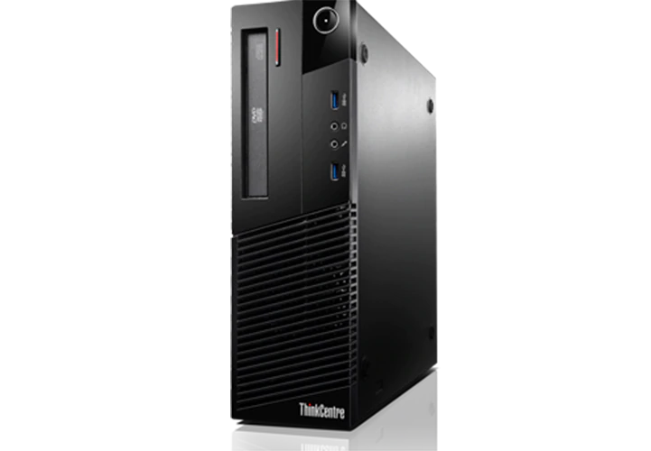

# Lenovo ThinkCentre M83 Intel HD 4400 Hackintosh OpenCore


```
Model              Lenovo ThinkCentre M83 SFF
Mainboard          Intel Q85
CPU                Intel Core i5-4460
Memory             16GB DDR3 1600MHz (4GB+2GB+2GB+8GB)
Graphics           Intel HD Graphics 4600
Audio              Realtek ALC283
Ethernet           Intel I217LM
Wi-Fi              No WiFi Card
Monitor            DELL 24340L FHD 1920x1080 
BIOS Version       FBKTDBAUS 12/24/2019
macOS Version      Catalina 10.15.7
OpenCore Version   0.6.7
```
Note : 
```
Intel HD 4600 : Please use DisplayPort (Harware Acceleration not working if connect monitor via VGA/D-SUB Port)

Serial Number : Please use your own serial number or regenerate.
```
